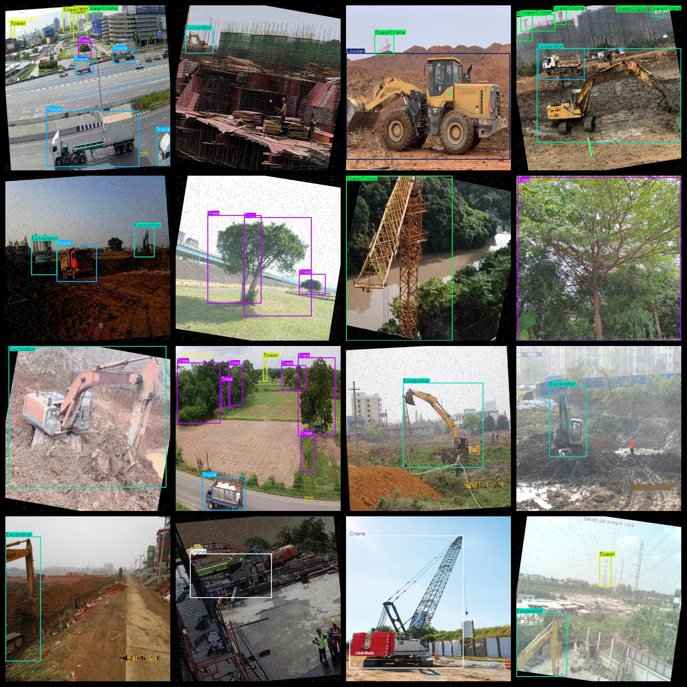
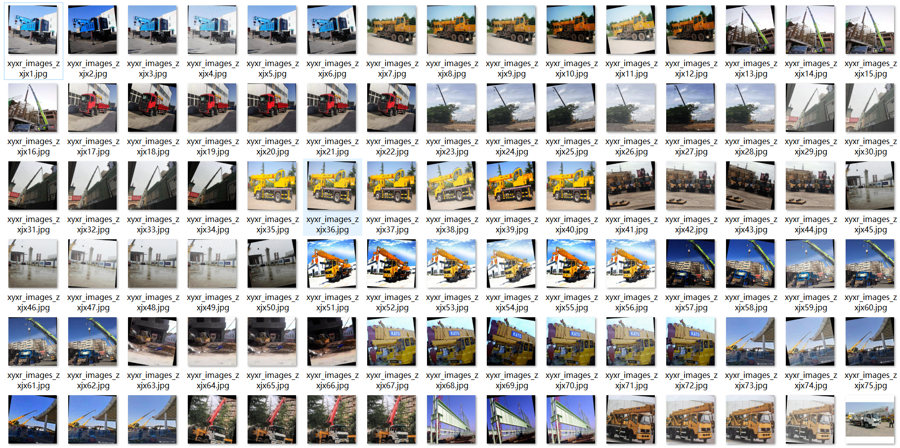
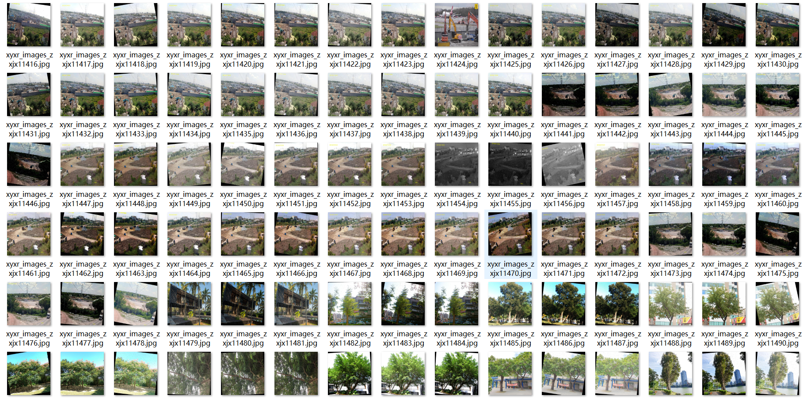

# [Object Detection] Crane Excavator Piling machine tower crane Building Tree etc Detection Dataset 19665 images YOLO+VOC format

【Target Detection】A dataset of 19,665 images for cranes, excavators, piling machines, tower cranes, and buildings, using the YOLO+VOC format.

Dataset Description: The dataset has been enhanced through rotation, interference, and other means. The image pixels are basically 640*640 in size, and the images are regular in angle, not aerial photography.

Dataset Format: Pascal VOC + YOLO (excluding the split-path txt file; only jpg images with corresponding VOC-format xml files and YOLO-format txt files)

The compressed file contains: three folders, each storing images, xml files, and text files.

The total number of jpg images in the JPEGImages folder is: 19665.

The total number of XML files in the Annotations folder: 19665

The total number of txt files in the labels folder is 19665.

Number of tag types: 11

Label Name: ["Building", "Bulldozer", "Crane", "Excavator", "Loader", "Pile Driving", "Roller", "Tower", "Tower Crane", "Tree", "Truck"]

Tags: [ "Building", "Loader", "Crane", "Excavator", "Loader", "Pile", "Wheel", "Tube", "Skid", "Tree", "Truck" ]

The number of boxes for each label (Note that the order of labels in the Yolo format does not correspond to this, but is based on the classes.txt file in the labels folder):

Building frame count = 18146

Bulldozer frame count = 481

Crane frame count = 4006

Excavator frame count = 8356

Loader frame count = 389

PileDriving frame count = 999

Roller frame count = 497

Tower frame count = 9143

TowerCrane frame count = 4643

Tree frame count = 11090

Truck frame count = 7027

Total number of boxes: 64,777

Picture clarity (Resolution: Pixels): Clear

Image Enhancement: Yes

Shape of the label: Rectangular box, used for object detection and recognition.

Important Note: None

Special Notice: This dataset does not guarantee the accuracy or precision of the trained models or weight files. The dataset only provides accurate and reasonable annotations.
## Images

---

Here is a pay link on Stripe (https://buy.stripe.com/3cs8yP7sY87d0vu9AB). Please contact me lonlonago@foxmail.com after funding $89, and I will send you a complete data files, thank you!

